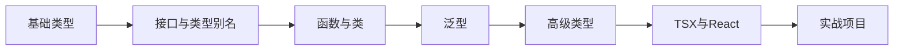

# TypeScript 完全指南 <Badge type="tip" text="TS 5.0" />

> [!TIP]
> TypeScript 是 JavaScript 的超集，添加了静态类型系统。本指南从基础到进阶，帮助你掌握类型安全的 JavaScript 开发。

## 📋 学习路径



| 阶段 | 内容 | 难度 |
|------|------|------|
| [第一阶段：基础](#一-基础类型) | 原始类型、数组、对象 | ⭐ |
| [第二阶段：接口](#二-接口与类型别名) | interface、type、联合类型 | ⭐⭐ |
| [第三阶段：函数与类](#三-函数与类) | 函数类型、类、修饰符 | ⭐⭐ |
| [第四阶段：泛型](#四-泛型) | 泛型函数、泛型约束 | ⭐⭐⭐ |
| [第五阶段：高级类型](#五-高级类型) | 映射类型、条件类型 | ⭐⭐⭐ |
| [第六阶段：TSX](#六-tsx-与-react) | JSX类型、组件Props | ⭐⭐⭐ |
| [第七阶段：实战](#七-项目实战) | 登录模块、数据表格 | ⭐⭐⭐ |


## 基础类型

### 1.1 原始类型

```typescript
// 布尔值
let isDone: boolean = false;

// 数字（支持十进制、十六进制、二进制、八进制）
let decimal: number = 6;
let hex: number = 0xf00d;
let binary: number = 0b1010;
let octal: number = 0o744;
let bigInt: bigint = 100n;  // ES2020

// 字符串
let color: string = "blue";
let fullName: string = `John Doe`;
let sentence: string = `Hello, my name is ${fullName}.`;

// 空值
function warnUser(): void {
  console.log("This is my warning message");
}

// null 和 undefined
let u: undefined = undefined;
let n: null = null;
```

### 1.2 数组与元组

```typescript
// 数组类型
let list1: number[] = [1, 2, 3];
let list2: Array<number> = [1, 2, 3];  // 泛型数组
let list3: (string | number)[] = [1, "two", 3];  // 联合类型数组

// 元组（固定长度和类型）
let tuple: [string, number] = ["hello", 10];
// tuple = [10, "hello"];  // 错误！顺序必须匹配

// 可选元素
let optionalTuple: [string, number?] = ["hello"];

// 剩余元素
let restTuple: [string, ...number[]] = ["hello", 1, 2, 3];

// 只读数组
let readonlyArray: ReadonlyArray<number> = [1, 2, 3];
// readonlyArray[0] = 4;  // 错误！
```

### 1.3 枚举类型

```typescript
// 数字枚举
enum Direction {
  Up = 1,      // 可以指定起始值
  Down,        // 自动递增为 2
  Left,        // 3
  Right        // 4
}

let dir: Direction = Direction.Up;
console.log(dir); // 1

// 字符串枚举
enum Color {
  Red = "RED",
  Green = "GREEN",
  Blue = "BLUE"
}

// 常量枚举（编译时内联，性能更好）
const enum ConstEnum {
  A = 1,
  B = 2
}

// 反向映射（仅数字枚举）
console.log(Direction[1]); // "Up"
```

### 1.4 any、unknown 和 never

```typescript
// any - 任意类型（尽量少用）
let notSure: any = 4;
notSure = "maybe a string";
notSure = false;
notSure.ifItExists();  // 可以调用任意方法

// unknown - 类型安全的 any
let notSure2: unknown = 4;
// notSure2.toFixed();  // 错误！不能直接操作

// 必须先进行类型检查
if (typeof notSure2 === "number") {
  notSure2.toFixed();  // 可以
}

// 或使用类型断言
(notSure2 as number).toFixed();

// never - 永不存在的值
function error(message: string): never {
  throw new Error(message);
}

function infiniteLoop(): never {
  while (true) {}
}
```


## 接口与类型别名

### 2.1 接口基础

```typescript
// 基本接口
interface Person {
  firstName: string;
  lastName: string;
  age?: number;           // 可选属性
  readonly id: number;    // 只读属性
}

function greet(person: Person): string {
  return `Hello, ${person.firstName} ${person.lastName}`;
}

let user: Person = {
  firstName: "Jane",
  lastName: "User",
  id: 123
};

// user.id = 456;  // 错误！只读属性
```

### 2.2 类型别名

```typescript
// 基本类型别名
type Name = string;
type NameResolver = () => string;
type NameOrResolver = Name | NameResolver;

// 对象类型别名
type Point = {
  x: number;
  y: number;
};

// 联合类型别名
type ID = string | number;
type Status = "pending" | "success" | "error";

// 函数类型别名
type GreetFunction = (name: string) => string;

// 泛型类型别名
type Container<T> = { value: T };
```

### 2.3 interface vs type

| 特性 | interface | type |
|------|-----------|------|
| 定义对象类型 | ✅ | ✅ |
| 定义联合类型 | ❌ | ✅ |
| 定义元组类型 | ❌ | ✅ |
| 扩展方式 | extends | &（交叉类型）|
| 同名合并 | ✅ | ❌ |
| 实现类 | ✅ | ❌ |

```typescript
// interface 扩展
interface Animal {
  name: string;
}

interface Dog extends Animal {
  breed: string;
}

// interface 同名合并（声明合并）
interface Window {
  title: string;
}

interface Window {
  ts: TypeScriptAPI;
}

// 最终 Window 包含 title 和 ts

// type 扩展
type Animal = {
  name: string;
};

type Dog = Animal & {
  breed: string;
};
```

### 2.4 索引签名

```typescript
// 字符串索引
interface StringDictionary {
  [index: string]: string;
}

let dict: StringDictionary = {
  name: "John",
  email: "john@example.com"
};

// 数字索引
interface NumberArray {
  [index: number]: string;
}

let arr: NumberArray = ["Alice", "Bob"];

// 混合索引
interface Mixed {
  [index: string]: string | number;
  name: string;  // 必须兼容索引签名
  age: number;
}
```


## 函数与类

### 3.1 函数类型

```typescript
// 函数声明
function add(x: number, y: number): number {
  return x + y;
}

// 函数表达式
let myAdd = function(x: number, y: number): number {
  return x + y;
};

// 完整类型写法
let myAdd2: (x: number, y: number) => number = function(
  x: number,
  y: number
): number {
  return x + y;
};

// 可选参数和默认参数
function buildName(firstName: string, lastName?: string): string {
  if (lastName) {
    return `${firstName} ${lastName}`;
  }
  return firstName;
}

function buildNameWithDefault(
  firstName: string,
  lastName: string = "Smith"
): string {
  return `${firstName} ${lastName}`;
}

// 剩余参数
function sum(...numbers: number[]): number {
  return numbers.reduce((total, num) => total + num, 0);
}

// 函数重载
function pickCard(x: { suit: string; card: number }[]): number;
function pickCard(x: number): { suit: string; card: number };
function pickCard(x: any): any {
  if (typeof x === "object") {
    return Math.floor(Math.random() * x.length);
  }
  return { suit: suits[Math.floor(x / 13)], card: x % 13 };
}
```

### 3.2 类

```typescript
// 基本类
class Greeter {
  greeting: string;

  constructor(message: string) {
    this.greeting = message;
  }

  greet() {
    return `Hello, ${this.greeting}`;
  }
}

let greeter = new Greeter("world");

// 访问修饰符
class Person {
  public name: string;      // 公开（默认）
  private age: number;      // 私有
  protected address: string; // 受保护（子类可访问）
  readonly id: number;      // 只读

  constructor(name: string, age: number, id: number) {
    this.name = name;
    this.age = age;
    this.id = id;
  }
}

// 参数属性简写
class Octopus {
  constructor(
    readonly name: string,
    private readonly numberOfLegs: number = 8
  ) {}
}

// 存取器
class Employee {
  private _fullName: string = "";

  get fullName(): string {
    return this._fullName;
  }

  set fullName(newName: string) {
    if (passcode && passcode === "secret passcode") {
      this._fullName = newName;
    } else {
      console.log("Error: Unauthorized update!");
    }
  }
}

// 静态属性
class Grid {
  static origin = { x: 0, y: 0 };

  constructor(public scale: number) {}

  calculateDistance(point: { x: number; y: number }) {
    let xDist = point.x - Grid.origin.x;
    let yDist = point.y - Grid.origin.y;
    return Math.sqrt(xDist * xDist + yDist * yDist) / this.scale;
  }
}

// 抽象类
abstract class Animal {
  abstract makeSound(): void;

  move(): void {
    console.log("roaming the earth...");
  }
}

class Dog extends Animal {
  makeSound(): void {
    console.log("Woof! Woof!");
  }
}
```


## 泛型

### 4.1 泛型基础

```typescript
// 泛型函数
function identity<T>(arg: T): T {
  return arg;
}

// 使用方式
let output1 = identity<string>("myString");
let output2 = identity("myString");  // 类型推断

// 泛型接口
interface GenericIdentityFn<T> {
  (arg: T): T;
}

// 泛型类
class GenericNumber<T> {
  zeroValue: T;
  add: (x: T, y: T) => T;
}

let myGenericNumber = new GenericNumber<number>();
myGenericNumber.zeroValue = 0;
myGenericNumber.add = function(x, y) { return x + y; };
```

### 4.2 泛型约束

```typescript
// 基本约束
interface Lengthwise {
  length: number;
}

function loggingIdentity<T extends Lengthwise>(arg: T): T {
  console.log(arg.length);  // 现在知道有 length 属性
  return arg;
}

loggingIdentity({ length: 10, value: 3 });
// loggingIdentity(3);  // 错误！number 没有 length

// 多个类型参数
function getProperty<T, K extends keyof T>(obj: T, key: K) {
  return obj[key];
}

let x = { a: 1, b: 2, c: 3 };
getProperty(x, "a");  // 可以
// getProperty(x, "m");  // 错误！"m" 不在 x 中

// 类类型约束
function create<T>(c: { new(): T }): T {
  return new c();
}
```


## 高级类型

### 5.1 类型断言

```typescript
// 尖括号语法
let someValue: any = "this is a string";
let strLength: number = (<string>someValue).length;

// as 语法（推荐，特别是 JSX 中）
let strLength2: number = (someValue as string).length;

// 非空断言
function processEntity(e?: Entity) {
  let s = e!.name;  // 确信 e 不为 null/undefined
}
```

### 5.2 类型保护

```typescript
// typeof 类型保护
function padLeft(value: string, padding: string | number) {
  if (typeof padding === "number") {
    return Array(padding + 1).join(" ") + value;
  }
  return padding + value;
}

// instanceof 类型保护
class Bird {
  fly() { console.log("flying"); }
}

class Fish {
  swim() { console.log("swimming"); }
}

function move(pet: Bird | Fish) {
  if (pet instanceof Bird) {
    pet.fly();
  } else {
    pet.swim();
  }
}

// 自定义类型保护
function isFish(pet: Bird | Fish): pet is Fish {
  return (pet as Fish).swim !== undefined;
}

if (isFish(pet)) {
  pet.swim();  // TypeScript 知道这是 Fish
}
```

### 5.3 映射类型

```typescript
// 只读类型
type Readonly<T> = {
  readonly [P in keyof T]: T[P];
};

// 可选类型
type Partial<T> = {
  [P in keyof T]?: T[P];
};

// 使用内置工具类型
interface Person {
  name: string;
  age: number;
}

let readonlyPerson: Readonly<Person> = {
  name: "John",
  age: 25
};
// readonlyPerson.age = 30;  // 错误！

let partialPerson: Partial<Person> = {
  name: "John"  // age 是可选的
};

// 其他内置工具类型
 type Required<T>      // 所有属性变为必需
 type Record<K, T>     // 构造对象类型
 type Pick<T, K>       // 选取部分属性
 type Omit<T, K>       // 省略部分属性
 type Exclude<T, U>    // 排除类型
 type Extract<T, U>    // 提取类型
 type NonNullable<T>   // 排除 null/undefined
 type ReturnType<T>    // 获取返回类型
 type Parameters<T>    // 获取参数类型
```

### 5.4 条件类型

```typescript
// 基本语法
type IsString<T> = T extends string ? true : false;

type A = IsString<string>;   // true
type B = IsString<number>;   // false

// infer 关键字
type ReturnType<T> = T extends (...args: any[]) => infer R ? R : any;

// 分布式条件类型
type ToArray<T> = T extends any ? T[] : never;
type StrOrNumArray = ToArray<string | number>;  // string[] | number[]
```


## TSX 与 React

### 6.1 TSX 配置

```json
// tsconfig.json
{
  "compilerOptions": {
    "jsx": "react-jsx",        // React 17+ 新转换模式
    // "jsx": "react",         // React 16 传统模式
    "jsxImportSource": "react",
    "esModuleInterop": true,
    "allowSyntheticDefaultImports": true
  }
}
```

### 6.2 函数组件

```tsx
import { FC, ReactNode } from 'react';

// Props 接口
interface GreetingProps {
  name: string;
  age?: number;
  children?: ReactNode;
}

// 方式一：使用 FC（FunctionComponent）
const Greeting: FC<GreetingProps> = ({ name, age, children }) => (
  <div>
    Hello, {name}!
    {age && <span>You are {age} years old.</span>}
    {children}
  </div>
);

// 方式二：直接声明（推荐）
function Greeting2({ name, age }: GreetingProps) {
  return (
    <div>
      Hello, {name}!
      {age && <span>You are {age} years old.</span>}
    </div>
  );
}

// 方式三：箭头函数
const Greeting3 = ({ name, age }: GreetingProps): JSX.Element => (
  <div>Hello, {name}!</div>
);

// 使用
<Greeting name="John" age={25} />
<Greeting name="Jane">Welcome!</Greeting>
```

### 6.3 Hooks 类型

```tsx
import { useState, useEffect, useCallback, useRef } from 'react';

// useState
const [count, setCount] = useState<number>(0);
const [user, setUser] = useState<User | null>(null);
const [items, setItems] = useState<string[]>([]);

// useEffect
useEffect(() => {
  console.log('Component mounted');
  
  return () => {
    console.log('Cleanup');
  };
}, []);  // 依赖数组

// useCallback
const handleSubmit = useCallback(
  (data: FormData) => {
    console.log(data);
  },
  []  // 依赖数组
);

// useRef
const inputRef = useRef<HTMLInputElement>(null);
inputRef.current?.focus();

// 自定义 Hook
function useLocalStorage<T>(key: string, initialValue: T) {
  const [storedValue, setStoredValue] = useState<T>(() => {
    try {
      const item = window.localStorage.getItem(key);
      return item ? JSON.parse(item) : initialValue;
    } catch {
      return initialValue;
    }
  });

  const setValue = (value: T | ((val: T) => T)) => {
    const valueToStore = value instanceof Function ? value(storedValue) : value;
    setStoredValue(valueToStore);
    window.localStorage.setItem(key, JSON.stringify(valueToStore));
  };

  return [storedValue, setValue] as const;
}
```

### 6.4 事件处理

```tsx
import { 
  MouseEvent, 
  ChangeEvent, 
  FormEvent, 
  KeyboardEvent 
} from 'react';

// 鼠标事件
const handleClick = (e: MouseEvent<HTMLButtonElement>) => {
  console.log(e.currentTarget.textContent);
};

// 输入事件
const handleChange = (e: ChangeEvent<HTMLInputElement>) => {
  console.log(e.target.value);
};

// 表单事件
const handleSubmit = (e: FormEvent<HTMLFormElement>) => {
  e.preventDefault();
  console.log('Form submitted');
};

// 键盘事件
const handleKeyDown = (e: KeyboardEvent<HTMLInputElement>) => {
  if (e.key === 'Enter') {
    console.log('Enter pressed');
  }
};

// 使用
<button onClick={handleClick}>Click</button>
<input onChange={handleChange} onKeyDown={handleKeyDown} />
<form onSubmit={handleSubmit}>
```


## 项目实战

### 7.1 登录模块

```typescript
// types/auth.ts
export interface User {
  id: number;
  username: string;
  email: string;
  avatar?: string;
  role: 'admin' | 'user';
}

export interface LoginCredentials {
  username: string;
  password: string;
  remember?: boolean;
}

export interface AuthResponse {
  user: User;
  token: string;
  expiresAt: number;
}

export interface AuthState {
  user: User | null;
  isAuthenticated: boolean;
  isLoading: boolean;
  error: string | null;
}

// hooks/useAuth.ts
import { useState, useCallback } from 'react';
import { LoginCredentials, AuthResponse, User } from '../types/auth';

export function useAuth() {
  const [user, setUser] = useState<User | null>(null);
  const [isLoading, setIsLoading] = useState(false);
  const [error, setError] = useState<string | null>(null);

  const login = useCallback(async (credentials: LoginCredentials): Promise<void> => {
    setIsLoading(true);
    setError(null);
    
    try {
      const response = await fetch('/api/auth/login', {
        method: 'POST',
        headers: { 'Content-Type': 'application/json' },
        body: JSON.stringify(credentials)
      });
      
      if (!response.ok) {
        throw new Error('Login failed');
      }
      
      const data: AuthResponse = await response.json();
      setUser(data.user);
      localStorage.setItem('token', data.token);
    } catch (err) {
      setError(err instanceof Error ? err.message : 'Unknown error');
    } finally {
      setIsLoading(false);
    }
  }, []);

  const logout = useCallback(() => {
    setUser(null);
    localStorage.removeItem('token');
  }, []);

  return { user, isLoading, error, login, logout };
}

// components/LoginForm.tsx
import { FC, useState } from 'react';
import { LoginCredentials } from '../types/auth';

interface LoginFormProps {
  onSubmit: (credentials: LoginCredentials) => void;
  isLoading?: boolean;
  error?: string | null;
}

export const LoginForm: FC<LoginFormProps> = ({ 
  onSubmit, 
  isLoading = false,
  error 
}) => {
  const [formData, setFormData] = useState<LoginCredentials>({
    username: '',
    password: '',
    remember: false
  });

  const handleSubmit = (e: React.FormEvent) => {
    e.preventDefault();
    onSubmit(formData);
  };

  return (
    <form onSubmit={handleSubmit}>
      {error && <div className="error">{error}</div>}
      <input
        type="text"
        placeholder="Username"
        value={formData.username}
        onChange={(e) => setFormData({ ...formData, username: e.target.value })}
      />
      <input
        type="password"
        placeholder="Password"
        value={formData.password}
        onChange={(e) => setFormData({ ...formData, password: e.target.value })}
      />
      <label>
        <input
          type="checkbox"
          checked={formData.remember}
          onChange={(e) => setFormData({ ...formData, remember: e.target.checked })}
        />
        Remember me
      </label>
      <button type="submit" disabled={isLoading}>
        {isLoading ? 'Loading...' : 'Login'}
      </button>
    </form>
  );
};
```

### 7.2 数据表格模块

```typescript
// types/table.ts
export interface Column<T> {
  key: keyof T;
  title: string;
  width?: number;
  sortable?: boolean;
  render?: (value: T[keyof T], record: T) => React.ReactNode;
}

export interface Pagination {
  current: number;
  pageSize: number;
  total: number;
}

export interface TableProps<T> {
  data: T[];
  columns: Column<T>[];
  loading?: boolean;
  pagination?: Pagination;
  onChange?: (pagination: Pagination) => void;
  onRowClick?: (record: T) => void;
}

// components/DataTable.tsx
import { FC, useState, useCallback } from 'react';
import { Column, Pagination, TableProps } from '../types/table';

export function DataTable<T extends Record<string, any>>({
  data,
  columns,
  loading = false,
  pagination,
  onChange,
  onRowClick
}: TableProps<T>) {
  const [sortKey, setSortKey] = useState<keyof T | null>(null);
  const [sortOrder, setSortOrder] = useState<'asc' | 'desc'>('asc');

  const handleSort = useCallback((key: keyof T) => {
    if (sortKey === key) {
      setSortOrder(sortOrder === 'asc' ? 'desc' : 'asc');
    } else {
      setSortKey(key);
      setSortOrder('asc');
    }
  }, [sortKey, sortOrder]);

  const sortedData = sortKey
    ? [...data].sort((a, b) => {
        const aVal = a[sortKey];
        const bVal = b[sortKey];
        if (aVal < bVal) return sortOrder === 'asc' ? -1 : 1;
        if (aVal > bVal) return sortOrder === 'asc' ? 1 : -1;
        return 0;
      })
    : data;

  return (
    <div className="data-table">
      <table>
        <thead>
          <tr>
            {columns.map((col) => (
              <th
                key={String(col.key)}
                style={{ width: col.width }}
                onClick={() => col.sortable && handleSort(col.key)}
              >
                {col.title}
                {sortKey === col.key && (sortOrder === 'asc' ? ' ↑' : ' ↓')}
              </th>
            ))}
          </tr>
        </thead>
        <tbody>
          {loading ? (
            <tr><td colSpan={columns.length}>Loading...</td></tr>
          ) : (
            sortedData.map((record, index) => (
              <tr key={index} onClick={() => onRowClick?.(record)}>
                {columns.map((col) => (
                  <td key={String(col.key)}>
                    {col.render
                      ? col.render(record[col.key], record)
                      : String(record[col.key])}
                  </td>
                ))}
              </tr>
            ))
          )}
        </tbody>
      </table>
      
      {pagination && (
        <div className="pagination">
          <button
            disabled={pagination.current === 1}
            onClick={() => onChange?.({ ...pagination, current: pagination.current - 1 })}
          >
            Previous
          </button>
          <span>{pagination.current} / {Math.ceil(pagination.total / pagination.pageSize)}</span>
          <button
            disabled={pagination.current * pagination.pageSize >= pagination.total}
            onClick={() => onChange?.({ ...pagination, current: pagination.current + 1 })}
          >
            Next
          </button>
        </div>
      )}
    </div>
  );
}

// 使用示例
interface User {
  id: number;
  name: string;
  email: string;
  status: 'active' | 'inactive';
}

const columns: Column<User>[] = [
  { key: 'id', title: 'ID', width: 80, sortable: true },
  { key: 'name', title: 'Name', sortable: true },
  { key: 'email', title: 'Email' },
  {
    key: 'status',
    title: 'Status',
    render: (value) => (
      <span className={value === 'active' ? 'text-green' : 'text-red'}>
        {value}
      </span>
    )
  }
];

<DataTable<User>
  data={users}
  columns={columns}
  pagination={{ current: 1, pageSize: 10, total: 100 }}
  onRowClick={(user) => console.log('Clicked:', user)}
/>
```


## 配置与工具

### 8.1 tsconfig.json 配置

```json
{
  "compilerOptions": {
    "target": "ES2020",
    "lib": ["ES2020", "DOM", "DOM.Iterable"],
    "module": "ESNext",
    "skipLibCheck": true,
    "moduleResolution": "bundler",
    "allowImportingTsExtensions": true,
    "resolveJsonModule": true,
    "isolatedModules": true,
    "noEmit": true,
    "jsx": "react-jsx",
    "strict": true,
    "noUnusedLocals": true,
    "noUnusedParameters": true,
    "noFallthroughCasesInSwitch": true,
    "baseUrl": ".",
    "paths": {
      "@/*": ["src/*"]
    }
  },
  "include": ["src"],
  "references": [{ "path": "./tsconfig.node.json" }]
}
```

### 8.2 类型声明文件

```typescript
// types/global.d.ts
// 全局类型声明

declare module '*.svg' {
  const content: React.FunctionComponent<React.SVGAttributes<SVGElement>>;
  export default content;
}

declare module '*.png' {
  const content: string;
  export default content;
}

// 扩展全局 Window
declare global {
  interface Window {
    myLib: any;
    API_URL: string;
  }
}

// 为第三方库添加类型
declare module 'some-untyped-lib' {
  export function doSomething(): void;
}
```


## 🔗 相关资源

- [TypeScript 官方文档](https://www.typescriptlang.org/docs/)
- [TypeScript 中文手册](https://typescript.bootcss.com/)
- [React + TypeScript 速查表](https://react-typescript-cheatsheet.netlify.app/)
- [Type Challenges](https://github.com/type-challenges/type-challenges) - 类型体操练习


> [!TIP]
> **学习建议**
> 1. 从基础类型开始，逐步掌握接口、泛型
> 2. 在真实项目中使用 TypeScript，类型安全会显著提升代码质量
> 3. 遇到复杂类型时，使用类型体操练习提升类型编程能力
> 4. 阅读优秀开源项目的类型定义，学习最佳实践
